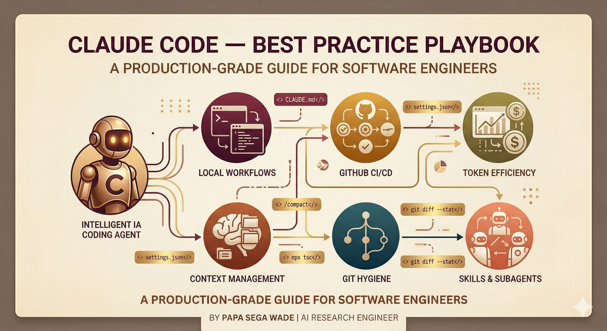

# Claude Code — Best Practice Playbook

> **Audience :** Software engineers who want production-grade Claude Code setups, not toy demos.  
> **Scope :** Local workflows + GitHub CI/CD + token efficiency + git hygiene.  
> **Series :** Canonical reference for the companion [claude-code-token-optimization](https://github.com/papasega/claude-code-token-optimization) prompt.

> **Version :** Claude Code ≥ 2.1.270 · Last updated: 2026-09 · Verify with `claude --version`

---


## Table of Contents

1. [Mental Model](#1-mental-model)
2. [Project Configuration — settings.json](#2-project-configuration--settingsjson)
3. [User Configuration — global defaults](#3-user-configuration--global-defaults)
4. [CLAUDE.md — the right way](#4-claudemd--the-right-way)
5. [Context Management — the critical constraint](#5-context-management--the-critical-constraint)
6. [Hooks — deterministic guardrails](#6-hooks--deterministic-guardrails)
7. [Skills Architecture](#7-skills-architecture)
8. [Subagents — isolated context delegation](#8-subagents--isolated-context-delegation)
9. [GitHub Actions Integration](#9-github-actions-integration)
10. [Git History Policy](#10-git-history-policy)
11. [Code Quality Automation — REVIEW.md + hooks](#11-code-quality-automation--reviewmd--hooks)
12. [Command Reference](#12-command-reference)
13. [Usage Monitoring](#13-usage-monitoring)
14. [Token Optimization Table](#14-token-optimization-table)
15. [File Structure Reference](#15-file-structure-reference)
16. [Gotchas & Common Mistakes](#16-gotchas--common-mistakes)

---

> **TL;DR — core rules:**
> 1. Keep `CLAUDE.md` under 200 lines — move procedures and references to skills
> 2. Set up hooks for git safety and large-file guidance — they fire deterministically, not "when Claude feels like it"
> 3. Use subagents for exploration, keep the main context clean for implementation
> 4. Use `/compact` when the current task needs room; use `/clear` between unrelated tasks
> 5. Claude modifies files, you own `git log` — enforce with `permissions.deny` + `attribution: {"commit":"","pr":""}`

## 1. Mental Model

Claude Code is a **terminal-based agentic coding assistant**. It reads files, runs bash commands, edits code, and coordinates subagents — in a loop. Understanding how that loop works is the foundation of every optimization.

```
User prompt
    │
    ▼
Claude reasons (consumes tokens)
    │
    ▼
Claude calls a tool (Read / Bash / Edit / Write / ...)
    │
    ├─► PreToolUse hooks fire → can BLOCK or MODIFY the call
    │
    ▼
Tool executes
    │
    ├─► PostToolUse hooks fire → formatting, linting, logging
    │
    ▼
Result enters context window → Claude reasons again
    │
    └─► Loop until task complete or Stop event
```

**The context window is the shared resource everything competes for.** Every file Claude reads, every bash output, every conversation turn — all of it accumulates. Performance degrades as it fills. This is not a limitation to work around; it's the central design constraint to engineer for.

**What Claude Code CAN do :**
- Read, create, and modify any file in the working directory
- Execute bash commands (linting, testing, building, git operations)
- Spawn subagents with separate isolated context windows
- Post comments on GitHub issues and PRs via MCP tools
- Work autonomously across multi-file changes

**What you control :**
- Which tools are allowed or denied (via `permissions`)
- What runs before/after each tool (via `hooks`)
- What context Claude starts each session with (via `CLAUDE.md` + skills)
- Whether Claude appears in git history (via `attribution`)

---

## 2. Project Configuration — settings.json

**File : `.claude/settings.json`** — committed to git, shared with the team.

```json
{
  "$schema": "https://json.schemastore.org/claude-code-settings.json",

  "permissions": {
    "allow": [
      "Bash(npm run lint)",
      "Bash(npm run lint:fix)",
      "Bash(npm run test *)",
      "Bash(npm run build)",
      "Bash(npm run type-check)",
      "Bash(git status)",
      "Bash(git diff *)",
      "Bash(git log --oneline *)",
      "Bash(git stash list)"
    ],
    "deny": [
      "Bash(git push *)",
      "Bash(git commit *)",
      "Bash(git checkout *)",
      "Bash(git merge *)",
      "Bash(git rebase *)",
      "Bash(git reset --hard *)",
      "Bash(git branch -d *)",
      "Bash(rm -rf *)",
      "Bash(sudo *)",
      "Read(./.env)",
      "Read(./.env.*)",
      "Read(./secrets/**)",
      "Edit(./.env)",
      "Edit(./.env.*)",
      "Edit(./secrets/**)"
    ]
  },

  "env": {
    "CLAUDE_CODE_ENABLE_TELEMETRY": "1"
  },

  "attribution": {
    "commit": "",
    "pr": ""
  },

  "disabledMcpjsonServers": ["filesystem"],

  "respectGitignore": true,
  "includeGitInstructions": true,

  "hooks": {
    "PreToolUse": [
      {
        "matcher": "Bash",
        "hooks": [
          {
            "type": "command",
            "command": "$CLAUDE_PROJECT_DIR/.claude/hooks/validate-bash.sh"
          }
        ]
      },
      {
        "matcher": "Read",
        "hooks": [
          {
            "type": "command",
            "command": "$CLAUDE_PROJECT_DIR/.claude/hooks/advise-large-read.sh"
          }
        ]
      }
    ],
    "PostToolUse": [
      {
        "matcher": "Write|Edit",
        "hooks": [
          {
            "type": "command",
            "command": "$CLAUDE_PROJECT_DIR/.claude/hooks/auto-format.sh"
          }
        ]
      }
    ]
  }
}
```

**Key design decisions :**

| Decision | Why |
|---|---|
| No project-wide model override | Inherit the account or user default unless the project has evaluated requirements |
| No project-wide effort override | Inherit the model default; change effort explicitly when the task requires it |
| No global fixed thinking-token override | Inherit the active model's reasoning mode and select effort per task; use `MAX_THINKING_TOKENS` only when intentionally operating a fixed-budget mode |
| `attribution: {commit: "", pr: ""}` | Claude's `Co-Authored-By` line is suppressed from all commits/PRs |
| `disabledMcpjsonServers: ["filesystem"]` | Reject the project MCP server named `filesystem`; review actual server names in `.mcp.json` |
| `deny` on `git push/commit/merge` | Enforce human-only git history (see §10) |

**`.claude/settings.local.json`** — local overrides, never committed :

```json
{
  "effortLevel": "high",
  "model": "opus"
}
```

Use this to override model or effort on your machine without affecting team defaults. Claude Code auto-adds it to `.gitignore`.

---

## 3. User Configuration — global defaults

**File : `~/.claude/settings.json`** — applies to all your projects.

```json
{
  "$schema": "https://json.schemastore.org/claude-code-settings.json",

  "autoUpdatesChannel": "stable",

  "permissions": {
    "allow": [
      "Bash(git diff *)",
      "Bash(git log --oneline *)",
      "Bash(git status)",
      "Read(~/.zshrc)",
      "Read(~/.bashrc)"
    ],
    "deny": [
      "Bash(sudo *)",
      "Bash(rm -rf *)"
    ]
  }
}
```

**Scope precedence (highest → lowest) :**
```
Managed settings (org IT) > CLI flags > settings.local.json > settings.json (project) > settings.json (user)
```

When the same key appears in multiple scopes, the higher scope wins. **Exception : arrays (like `permissions.deny`) merge across all scopes** — they are concatenated and deduplicated, not overwritten.

---

## 4. CLAUDE.md — the right way

CLAUDE.md is loaded into context at the start of every session — every line adds tokens on every turn. Treat it like code: ruthless brevity, zero redundancy.

**Rules :**
- **Global** (`~/.claude/CLAUDE.md`) : ≤ 200 lines — personal style, universal conventions
- **Project** (`CLAUDE.md` or `.claude/CLAUDE.md`) : under 200 lines — project-specific only
- **Subdirectory** (e.g. `src/api/CLAUDE.md`) : concise and path-specific — loaded only when Claude reads files in that directory
- **Never duplicate** rules that already exist at a higher level
- **Use `<!-- comment -->`** for maintainer notes — stripped from context automatically
- **Move workflows to skills** — they load on-demand, not at startup

**Example project CLAUDE.md (TypeScript/Express) :**

```markdown
<!-- Compact instructions: preserve modified files, test commands, active task. Discard exploration history. -->

# Project: [Name]

## Git policy
- ❌ NEVER run git commit, git push, git checkout, git merge, git rebase
- ✅ Run git diff / git status freely
- ✅ Modify files — developer reviews and commits

## Architecture
- `src/api/`  — Express routers (one file per resource)
- `src/auth/` — JWT middleware
- `src/db/`   — Prisma models + migrations
- `tests/`    — Jest, co-located in `__tests__/`

## Commands
- `npm run dev`        — start dev server
- `npm run test`       — run full test suite
- `npm run lint:fix`   — lint + autofix
- `npm run type-check` — TypeScript strict check
- `npm run build`      — compile to dist/

## Code standards
- `async/await` everywhere — no callbacks, no bare Promises
- `AppError` for all thrown errors — never `throw new Error()`
- No `any` without explicit `// eslint-disable-next-line` comment
- Tests required for all new public functions

## On-demand skills
- `/project-architecture` — full codebase map before large analysis
- `/code-review`          — PR review checklist
- `/git-safe`             — diff workflow after Claude modifies files
```

**What NOT to put in CLAUDE.md :**
- Full API documentation → put in a skill's reference files (loaded only when needed)
- Deployment runbooks → put in a skill
- Long lists of edge cases → put in a skill
- Code examples longer than 5 lines → put in a skill
- Content duplicated from `~/.claude/CLAUDE.md`

---

## 5. Context Management — the critical constraint

The context window holds everything: conversation history, file reads, bash output, CLAUDE.md, skills loaded, subagent responses. It fills fast. LLM performance degrades as it fills — Claude "forgets" earlier instructions, makes more mistakes.

**Auto-compaction is configured as a token budget, not a universal percentage.** The
*auto-compact window* is how full the context may get before Claude Code compacts, and
its automatic value is tuned for the active model. Use `/context` to inspect the
current session instead of assuming a fixed threshold.

### When to use each command

| Situation | Command | What it does |
|---|---|---|
| Switching to unrelated task | `/clear` (or `/reset` or `/new`) | Wipes all history. File edits persist. |
| Long session, still on same task | `/compact [instructions]` | Replaces history with a dense summary |
| Want to try a different approach | `/branch` | Branch conversation, experiment, resume the original |
| Quick lookup, don't want it in context | `/btw [question]` | Answer appears in overlay, never enters history |
| Session getting foggy | `Esc + Esc` | Open rewind menu — roll back conversation or code |
| Resume yesterday's session | `claude -c` | Continue the most recent session in current dir |

**Always pair `/rename` with `/clear` :**
```
/rename auth-refactor-session-2025-03
/clear
```
Named sessions appear in history and are findable weeks later.

**Custom compaction instructions in CLAUDE.md :**
```markdown
<!-- Compact instructions: preserve modified file list, test commands, active task. Discard: exploration history, verbose tool output. -->
```

**Compaction is triggered by :**
- You running `/compact`
- Auto-compaction, when the context reaches the auto-compact window

**Setting the window (token counts, highest precedence last) :**

| Where | How | Scope |
|---|---|---|
| `autoCompactWindow` in settings.json | `"autoCompactWindow": 500000` | Saved default |
| `/autocompact <tokens>` | `/autocompact 500k` — `/autocompact auto` restores the tuned value | Writes the setting |
| `--autocompact` flag | `claude --autocompact 500000` | One launch |
| `CLAUDE_CODE_AUTO_COMPACT_WINDOW` | `100000`–`1000000`, plain integer only | Overrides all of the above |

`CLAUDE_AUTOCOMPACT_PCT_OVERRIDE=60` still exists, but it is a **percentage of that
window**, not of the model's context, and it can only compact *earlier* — values above
the default are ignored.

### The subagent pattern for research

When Claude needs to explore a codebase before implementing, every file it reads bloats the main context. Instead:

```
Use a subagent to investigate how our authentication middleware handles token refresh.
Return a summary of: relevant file paths, current behavior, and any edge cases found.
Keep the summary under 200 words.
```

The subagent runs in a **separate, isolated context window**. It explores, then returns a compact report. Your main context stays clean for implementation.

---

## 6. Hooks — deterministic guardrails

Hooks are shell scripts (or HTTP endpoints) that run at specific points in Claude Code's lifecycle. Unlike CLAUDE.md instructions — which are requests Claude interprets — **hooks execute deterministically, every time**.

**Exit code contract :**
- `exit 0` → success. Stdout is read as JSON when it looks like JSON, otherwise as plain text
- `exit 1` → non-blocking error — shown to the user, execution continues
- `exit 2` → blocking error — Claude receives the stderr message and must address it

**Blocking a `PreToolUse` call — two valid shapes, never mixed :**

1. **Plain text on stderr + `exit 2`.** Simplest, and what the blocking hook below uses.
2. **Structured JSON on stdout + `exit 0`**, with the decision nested inside
   `hookSpecificOutput`:

```json
{
  "hookSpecificOutput": {
    "hookEventName": "PreToolUse",
    "permissionDecision": "deny",
    "permissionDecisionReason": "Explain what to do instead"
  }
}
```

`permissionDecision` accepts `allow`, `deny` and `ask`.

> **A top-level `{"decision": "block"}` does NOT work for `PreToolUse`.** That shape
> belongs to other events such as `PostToolUse` and `Stop`. On `PreToolUse` the JSON
> still parses, the misplaced field is ignored without an error, and **the tool call
> proceeds** — a guardrail that looks installed and blocks nothing. Fields at the
> wrong nesting level fail this way silently; run `claude --debug` and look for
> `Hook JSON output had unrecognized keys` to catch it.

**Hook input :** all hooks receive a JSON object on `stdin`. For tool events, `tool_name` and `tool_input` are the key fields.

**Environment variables available in hooks :**
- `$CLAUDE_PROJECT_DIR` — absolute path to project root
- `$CLAUDE_PLUGIN_ROOT` — absolute path to the plugin providing the hook, if any
- `$CLAUDE_EFFORT` — effort level active for the current turn
- `$CLAUDE_CODE_BRIDGE_SESSION_ID` — current session ID

Two implementation styles are valid and can coexist:
- **Inline JSON command** (used in settings.json §1): best for simple one-liner logic, easier to version with the project config
- **External script** (used in hooks below): best for logic > 5 lines, easier to test independently with `echo '{...}' | bash hook.sh`

Both styles receive JSON on stdin and communicate via exit codes.
Choose inline for simplicity, external scripts for maintainability.

### Hook 1 : Intercept known-dangerous Bash commands

**`.claude/hooks/validate-bash.sh`** — make executable with `chmod +x`

```bash
#!/bin/bash
# validate-bash.sh — PreToolUse hook for Bash commands.
# Blocks a set of known-dangerous command shapes before Claude Code runs them.
# Protocol: plain text on stderr + exit 2. Silence + exit 0 to allow.
set -euo pipefail

INPUT=$(cat)
COMMAND=$(printf '%s' "$INPUT" | python3 -c "
import json, sys
try:
    data = json.load(sys.stdin)
except (json.JSONDecodeError, UnicodeError, ValueError):
    sys.exit(0)
if isinstance(data, dict):
    print(data.get('tool_input', {}).get('command', ''))
" 2>/dev/null || true)

if [ -z "${COMMAND:-}" ]; then
  exit 0
fi

# Command boundary: start of string, or after a shell separator.
# POSIX classes throughout — grep -E does not understand \s.
BOUNDARY='(^|[[:space:]]|;|&&|\|\||\|)'

block() {
  printf '%s\n' "$1" >&2
  exit 2
}

if printf '%s' "$COMMAND" | grep -qE "${BOUNDARY}git[[:space:]]+push([[:space:]]|$)"; then
  block "git push is blocked by policy. Push manually after reviewing the diff."
fi

if printf '%s' "$COMMAND" | grep -qE "${BOUNDARY}git[[:space:]]+reset[[:space:]]+--hard([[:space:]]|$)"; then
  block "git reset --hard is blocked: it discards uncommitted work irreversibly."
fi

# rm with both recursive and force, in either order, short or long form.
RM_SHORT_RF="-[A-Za-z]*r[A-Za-z]*f"
RM_SHORT_FR="-[A-Za-z]*f[A-Za-z]*r"
RM_LONG_RF="--recursive([[:space:]]+-[A-Za-z-]+)*[[:space:]]+--force"
RM_LONG_FR="--force([[:space:]]+-[A-Za-z-]+)*[[:space:]]+--recursive"
RM_SPLIT_RF="-[A-Za-z]*r[A-Za-z]*([[:space:]]+-[A-Za-z-]+)*[[:space:]]+-[A-Za-z]*f"
RM_SPLIT_FR="-[A-Za-z]*f[A-Za-z]*([[:space:]]+-[A-Za-z-]+)*[[:space:]]+-[A-Za-z]*r"

if printf '%s' "$COMMAND" | grep -qE \
  "${BOUNDARY}rm[[:space:]]+([A-Za-z-]+[[:space:]]+)*(${RM_SHORT_RF}|${RM_SHORT_FR}|${RM_LONG_RF}|${RM_LONG_FR}|${RM_SPLIT_RF}|${RM_SPLIT_FR})([[:space:]]|$)"; then
  block "Recursive forced delete (rm -rf and equivalents) is blocked."
fi

if printf '%s' "$COMMAND" | grep -qE "${BOUNDARY}chmod[[:space:]]+(-[A-Za-z-]+[[:space:]]+)*777([[:space:]]|$)"; then
  block "chmod 777 is blocked: world-writable permissions are almost never intended."
fi

if printf '%s' "$COMMAND" | grep -qE '(>|>>)[[:space:]]*/(etc|usr|var|boot|sys)/'; then
  block "Writing into a system directory is blocked."
fi

exit 0
```

This hook complements permission rules; it does not parse shell grammar. Quoting,
wrappers, aliases and variable indirection can evade regular expressions, while a
quoted mention such as `echo git push` may be blocked. Treat it as defence in depth,
not as a complete security boundary.

### Hook 2 : Advise on large-file reads

**`.claude/hooks/advise-large-read.sh`**

```bash
#!/bin/bash
# advise-large-read.sh — PreToolUse hook for the Read tool.
# Adds guidance for large files without denying the read.
set -euo pipefail

INPUT=$(cat)
FILE=$(printf '%s' "$INPUT" | python3 -c "
import json, sys
try:
    data = json.load(sys.stdin)
except (json.JSONDecodeError, UnicodeError, ValueError):
    sys.exit(0)
if isinstance(data, dict):
    print(data.get('tool_input', {}).get('file_path', ''))
" 2>/dev/null || true)

if [ -z "${FILE:-}" ] || [ ! -f "$FILE" ]; then
  exit 0
fi

LINES=$(wc -l < "$FILE" 2>/dev/null | tr -d '[:space:]' || echo 0)
case "$LINES" in ''|*[!0-9]*) exit 0 ;; esac

if [ "$LINES" -gt 300 ]; then
  FILE="$FILE" LINES="$LINES" python3 -c "
import json, os
path = os.environ['FILE']
lines = os.environ['LINES']
print(json.dumps({
    'hookSpecificOutput': {
        'hookEventName': 'PreToolUse',
        'additionalContext': (
            f'{path} has {lines} lines. Start with targeted extraction when '
            'locating a symbol or error. Read the complete file when the task '
            'depends on its invariants, control flow, or interactions.'
        ),
    }
}))
"
fi

exit 0
```

The hook returns guidance only. It deliberately omits `permissionDecision`, so the
normal permission flow continues and Claude can read the whole file when necessary.

### Hook 3 : Auto-format on file write (PostToolUse)

**`.claude/hooks/auto-format.sh`**

```bash
#!/bin/bash
# Auto-run formatter after Claude edits a file
set -euo pipefail

INPUT=$(cat)
FILE=$(echo "$INPUT" | python3 -c "
import json, sys
print(json.load(sys.stdin).get('tool_input', {}).get('file_path', ''))
" 2>/dev/null || echo "")

if [ -z "$FILE" ] || [ ! -f "$FILE" ]; then
  exit 0
fi

# TypeScript / JavaScript
if echo "$FILE" | grep -qE '\.(ts|tsx|js|jsx)$'; then
  if command -v npx &>/dev/null; then
    npx prettier --write "$FILE" 2>/dev/null || true
  fi
fi

# Python
if echo "$FILE" | grep -qE '\.py$'; then
  if command -v ruff &>/dev/null; then
    ruff format "$FILE" 2>/dev/null || true
  fi
fi

# Go
if echo "$FILE" | grep -qE '\.go$'; then
  if command -v gofmt &>/dev/null; then
    gofmt -w "$FILE" 2>/dev/null || true
  fi
fi

exit 0
```

### Hook 4 : Gate Stop — run tests before Claude declares done

**In `.claude/settings.json` hooks section :**

> **The pipeline trap.** A command like `npm run test 2>&1 | tail -5 || exit 2` never
> blocks: a pipeline's exit status is that of its **last** command, so `tail` returns 0
> and `|| exit 2` never fires. The gate reports success while the suite is red. Use an
> external script with `set -o pipefail`, as below.

**`.claude/hooks/gate-tests.sh`** — make executable with `chmod +x`

```bash
#!/bin/bash
# Stop hook: refuse to end the turn while the test suite is failing.
set -uo pipefail

INPUT=$(cat)

# stop_hook_active guards against an infinite loop: it is true when this hook
# already caused Claude to keep working.
ACTIVE=$(printf '%s' "$INPUT" | python3 -c "
import json, sys
try:
    data = json.load(sys.stdin)
except (json.JSONDecodeError, UnicodeError, ValueError):
    sys.exit(0)
print('true' if isinstance(data, dict) and data.get('stop_hook_active') else '')
" 2>/dev/null || true)

if [ -n "${ACTIVE:-}" ]; then
  exit 0
fi

# pipefail makes the pipeline carry npm's status, not tail's.
OUTPUT=$(npm run test 2>&1)
STATUS=$?

if [ "$STATUS" -ne 0 ]; then
  printf 'Test suite failed (exit %s). Last lines:\n' "$STATUS" >&2
  printf '%s\n' "$OUTPUT" | tail -20 >&2
  exit 2
fi

exit 0
```

Register it in `.claude/settings.json` :

```json
"Stop": [
  {
    "hooks": [
      {
        "type": "command",
        "command": "$CLAUDE_PROJECT_DIR/.claude/hooks/gate-tests.sh"
      }
    ]
  }
]
```

> **Important :** Always check `stop_hook_active` in Stop hooks to prevent infinite loops. When Claude's Stop hook causes Claude to keep working, the field is set to `true` on subsequent invocations.

### Hook 5 : SessionStart — inject git context

`SessionStart` is one of the few events where **plain stdout already reaches Claude's
context**, so a hook that only loads context needs no JSON at all:

```json
"SessionStart": [
  {
    "hooks": [
      {
        "type": "command",
        "command": "echo \"Branch: $(git branch --show-current 2>/dev/null || echo no-git) | Last commit: $(git log --oneline -1 2>/dev/null || echo none)\""
      }
    ]
  }
]
```

This injects the current git branch and last commit into every session start — Claude knows where it is without reading git manually.

> **If you do emit JSON, nest it.** A top-level `{"additionalContext": "..."}` parses
> but is ignored, and the context never arrives. The structured form is:
>
> ```json
> {"hookSpecificOutput": {"hookEventName": "SessionStart", "additionalContext": "..."}}
> ```
>
> Use it only when you need to combine context with another field such as
> `sessionTitle`. For plain context, the `echo` above is less error-prone — it avoids
> three levels of shell quote escaping.

---

## 7. Skills Architecture

Skills keep their full body out of context until invocation. Their names and
descriptions remain in the discovery context unless model invocation is disabled,
so keep descriptions concise and move workflow details into the skill body.

**At startup, Claude loads :** `name` + `description` from each model-invocable skill.
**When a skill is triggered in a regular session :** the full `SKILL.md` body loads
into context. Skills explicitly preloaded into a subagent load when that subagent starts.

### Skill: project-architecture

**`.claude/skills/project-architecture/SKILL.md`**

````markdown
---
name: project-architecture
description: >
  Load full codebase map before large analysis tasks.
  Triggers: "architecture", "project overview", "how is X organized",
  before any analysis spanning multiple modules.
---

# Project Architecture

## Module map
- `src/api/`    — Express routers (one file per HTTP resource)
- `src/auth/`   — JWT validation middleware + refresh logic
- `src/db/`     — Prisma schema, migrations, seed scripts
- `src/utils/`  — Pure utility functions (no side effects)
- `tests/`      — Jest test suite, co-located `__tests__/` dirs

## Locate key entry points before selecting what context to read
```bash
# Find all route definitions
grep -rn "router\.\(get\|post\|put\|delete\)" src/api/ --include="*.ts"

# Find all exported functions in a module
grep -n "^export" src/auth/index.ts

# Find where an entity is used
grep -rn "UserRepository" src/ --include="*.ts" -l
```

## Dependency graph shortcut
```bash
# Direct dependencies of a file (TypeScript imports)
grep -n "^import" src/auth/middleware.ts

# Who imports a given module
grep -rn "from.*auth/middleware" src/ --include="*.ts"
```
````

### Skill: code-review

**`.claude/skills/code-review/SKILL.md`**

````markdown
---
name: code-review
description: >
  Structured PR review checklist. Triggers: "review this PR",
  "analyze this code", "what's wrong with", "check this diff".
---

# Code Review Process

## Step 1: Start with the diff
```bash
git diff HEAD~1 --stat              # What changed and how much
git diff HEAD~1 -- path/to/file.ts  # Targeted diff for one file
```

Read surrounding sections or the full files whenever the review requires their
contracts, invariants, or control flow.

## Step 2: Review checklist

### Correctness
- [ ] Logic handles all edge cases (null, empty array, zero, negative)
- [ ] No off-by-one errors in loops or pagination
- [ ] Async errors are caught (unhandled rejections = silent prod bugs)

### Type safety (TypeScript)
- [ ] No implicit `any` — each should have `// eslint-disable-next-line` justification
- [ ] Return types explicit on all public functions
- [ ] Discriminated unions used for complex state

### Error handling
- [ ] HTTP endpoints return correct status codes (not always 200 + error body)
- [ ] No empty `catch` blocks
- [ ] Error messages don't leak internal stack traces to clients

### Security
- [ ] No secrets hardcoded (even in test fixtures)
- [ ] SQL queries use parameterized statements — no string interpolation
- [ ] User input validated with Zod before hitting business logic

### Tests
- [ ] New public functions have unit tests
- [ ] Edge cases covered: null input, empty array, error path
- [ ] No `it.only` or `xit` left in codebase

## Step 3: Output format for GitHub comment
```markdown
## Code Review

### ✅ Strengths
- [what was done well]

### ⚠️ Issues
| Severity | File:line | Issue |
|----------|-----------|-------|
| 🔴 critical | auth.ts:42 | SQL injection via string concat |
| 🟡 warning  | user.ts:87 | Missing error handling on DB call |
| 🔵 info     | types.ts:12 | Could use discriminated union |

### 💡 Suggestions (non-blocking)
- [optional improvements]
```
````

### Skill: test-writing

**`.claude/skills/test-writing/SKILL.md`**

````markdown
---
name: test-writing
description: >
  Write comprehensive Jest tests. Triggers: "write tests for", "add test coverage",
  "test this function", before any new public API is added.
---

# Test Writing — Jest + TypeScript

## Structure: Arrange / Act / Assert
```typescript
describe('ModuleName', () => {
  describe('functionName', () => {
    it('should [expected behavior] when [condition]', () => {
      // Arrange — set up test data and mocks
      const input = buildTestUser({ email: 'test@example.com' });
      
      // Act — call the function under test
      const result = validateEmail(input.email);
      
      // Assert — verify outcome
      expect(result).toBe(true);
    });
  });
});
```

## Test matrix — cover ALL of these
| Case | Description |
|------|-------------|
| Happy path | Normal input, expected output |
| Empty/null | `null`, `undefined`, `''`, `[]`, `{}` |
| Boundary | Max/min values, exact thresholds |
| Error path | Invalid input throws expected error |
| Async errors | Rejected promises are caught |

## Mock patterns
```typescript
// Mock a module
jest.mock('../db/userRepository');
const mockGetUser = jest.mocked(getUserById);
mockGetUser.mockResolvedValue(buildTestUser());

// Spy on a method
const consoleSpy = jest.spyOn(console, 'error').mockImplementation();

// Cleanup
afterEach(() => jest.clearAllMocks());
```

## Test factories (prefer over inline objects)
```typescript
// tests/factories/user.factory.ts
export const buildTestUser = (overrides: Partial<User> = {}): User => ({
  id: crypto.randomUUID(),
  email: 'default@test.com',
  createdAt: new Date('2025-01-01'),
  ...overrides,
});
```
````

### Skill: git-safe

**`.claude/skills/git-safe/SKILL.md`**

````markdown
---
name: git-safe
description: >
  Review Claude's file changes before committing. Triggers: "show changes",
  "what did you modify", "stage these", "ready to commit".
---

# Git-Safe Workflow

## After Claude modifies files
```bash
git status                  # What changed
git diff                    # Full diff of all changes
git diff path/to/file.ts    # Diff for one file
git add -p                  # Interactively stage hunks (recommended)
```

## Verify Claude didn't touch git history
```bash
git log --oneline -5        # Should show only your commits
git status                  # Modified files, NOT new commits
```

## Revert if needed
```bash
git checkout -- .           # Revert all unstaged changes
git stash                   # Stash changes temporarily
```

## Write the commit message yourself
```bash
git add -p                          # Review each hunk
git commit -m "feat(auth): ..."     # Conventional commits format
```
`attribution: {commit: "", pr: ""}` in settings.json ensures
no `Co-Authored-By: Claude` line appears — even if you forget.
````

---

## 8. Subagents — isolated context delegation

Subagents are separate Claude Code instances with their own context window. When a subagent finishes, it returns a summary to the parent — not the full exploration history.

**Use subagents for :**
- Codebase research/exploration before implementing
- Parallel independent tasks (test one module while refactoring another)
- Specialized review tasks that shouldn't pollute the main session

### Subagent: code-explorer

**`.claude/agents/code-explorer.md`**

````markdown
---
name: code-explorer
description: >
  Fast codebase exploration. Use for: finding where X is implemented,
  mapping dependencies, understanding module behavior before editing.
  Returns a compact summary — does NOT read full files when unnecessary.
maxTurns: 10
tools: Read, Bash, Glob, Grep
---

You are a fast, efficient code navigator. Explore, then summarize compactly.

## Exploration rules
- Use `grep -n "pattern" file` instead of reading entire files
- Use `grep -rn "symbol" src/ -l` to find files before reading them
- Stop when you have enough to answer — do not explore exhaustively
- Use targeted extraction when locating one symbol; read the full file when its
  invariants or control flow are relevant

## Response format (ALWAYS)
Return a JSON block:
```json
{
  "relevant_files": ["src/auth/middleware.ts:15-45"],
  "key_findings": ["JWT validation happens at line 23", "No refresh token logic found"],
  "recommended_approach": "Add refresh endpoint in src/auth/ alongside existing middleware",
  "files_read": 3,
  "grep_calls": 5
}
```
````

### Subagent: pr-reviewer

**`.claude/agents/pr-reviewer.md`**

```markdown
---
name: pr-reviewer
description: >
  Thorough PR review. Use when a developer asks for a full review
  of their implementation. Runs the full code-review checklist,
  returns structured feedback for a GitHub comment.
maxTurns: 15
tools: Read, Bash, Grep, Glob
---

You are a senior software engineer doing a thorough code review.

## Process
1. Run `git diff HEAD~1 --stat` — scope the change
2. For each changed file: run targeted diff, not full file read
3. Apply the code-review checklist (from project skills)
4. Produce a structured review comment

## Output format
Return a complete markdown block ready to paste as a GitHub PR comment.
Flag: 🔴 critical (must fix), 🟡 warning (should fix), 🔵 info (optional).
```

---

## 9. GitHub Actions Integration

The official action is `anthropics/claude-code-action@v1`. Control what Claude does through `--allowedTools` in `claude_args`. There are **no** `read_only`, `no_commits`, or `mode: "review-only"` parameters in the v1 API.

### 9.1 PR Code Review (comment-only)

**`.github/workflows/claude-review.yml`**

```yaml
name: Claude PR Review

on:
  pull_request:
    types: [opened, synchronize]
  issue_comment:
    types: [created]

# Minimal permissions — grant only what Claude actually needs
permissions:
  contents: read          # Read source code
  pull-requests: write    # Post PR comments
  issues: write           # Post issue comments
  id-token: write         # GitHub App OIDC auth

jobs:
  claude-review:
    if: |
      github.event_name == 'pull_request' ||
      (github.event_name == 'issue_comment' && contains(github.event.comment.body, '@claude'))

    runs-on: ubuntu-latest
    timeout-minutes: 10

    steps:
      - uses: actions/checkout@v4
        with:
          fetch-depth: 0  # Full history for accurate diffs

      - uses: anthropics/claude-code-action@v1
        with:
          anthropic_api_key: ${{ secrets.ANTHROPIC_API_KEY }}
          prompt: |
            Review this PR and post a structured comment with:
            1. Correctness issues (bugs, edge cases missed)
            2. Security concerns (injection, auth bypass, secret exposure)
            3. Test coverage gaps
            4. Performance red flags

            Be concise. Flag only real issues — not style preferences.
            DO NOT commit or push anything.

          # Only these tools are available — no Write, no git push/commit
          claude_args: |
            --max-turns 5
            --allowedTools "Read,Grep,Glob,Bash(git diff *),Bash(git log --oneline *),Bash(npm run test *),Bash(npm run type-check),mcp__github__create_review_comment,mcp__github__create_issue_comment"
```

### 9.2 Automated security scan (headless, on push)

```yaml
name: Claude Security Scan

on:
  push:
    branches: [main, develop]

permissions:
  contents: read
  pull-requests: write
  id-token: write

jobs:
  security-scan:
    runs-on: ubuntu-latest

    steps:
      - uses: actions/checkout@v4
        with:
          fetch-depth: 0

      - uses: anthropics/claude-code-action@v1
        with:
          anthropic_api_key: ${{ secrets.ANTHROPIC_API_KEY }}
          prompt: |
            Scan the diff from the last push for security issues only:
            - Hardcoded secrets or API keys
            - SQL/command injection vectors
            - Missing input validation on new endpoints
            - Auth/authz bypasses

            Report only confirmed issues, not hypothetical risks.
            Format: one bullet per issue with file:line reference.

          claude_args: |
            --max-turns 3
            --allowedTools "Read,Grep,Glob,Bash(git diff *),mcp__github__create_issue_comment"
```

### 9.3 Using Custom GitHub App (recommended for teams)

```yaml
- name: Generate token from custom app
  id: app-token
  uses: actions/create-github-app-token@v2
  with:
    app-id: ${{ secrets.APP_ID }}
    private-key: ${{ secrets.APP_PRIVATE_KEY }}

- uses: anthropics/claude-code-action@v1
  with:
    # Use app token instead of direct API key
    # Comments appear as your app's bot name, not claude[bot]
    github_token: ${{ steps.app-token.outputs.token }}
    anthropic_api_key: ${{ secrets.ANTHROPIC_API_KEY }}
    claude_args: |
      --allowedTools "Read,Grep,Glob,mcp__github__create_review_comment"
```

> **Quick setup :** Run `claude /install-github-app` in your terminal. It walks through GitHub App creation and injects the workflow YAML automatically.

---

## 10. Git History Policy

The goal: Claude's work appears in the codebase (files modified) but **never** in `git log`, commit author fields, or `Co-Authored-By` trailers.

### Two-layer enforcement

**Layer 1 — settings.json deny rules :** Prevent Claude from running git write commands (§2).

**Layer 2 — attribution suppression :** Even if a commit is made with Claude's help, the trailer is suppressed:

```json
"attribution": {
  "commit": "",
  "pr": ""
}
```

With empty strings, Claude Code writes no `Co-Authored-By: Claude` line in commits or PR descriptions. `git log --all` will show only human authors.

### Verify the policy is working

```bash
# After a session where Claude modified files
git log --oneline -5          # Should show only your commits
git log --format="%an %ae" -5 # Should show only your email
git show HEAD | grep -i claude # Should return nothing
```

### The developer workflow with Claude

```bash
# 1. Let Claude modify files
# "Implement the user registration endpoint"

# 2. Review everything Claude did
git diff
git diff --stat

# 3. Interactively stage what you want
git add -p

# 4. Write your own commit message
git commit -m "feat(auth): add user registration endpoint"

# 5. Push — Claude never appears
git push
```

---

## 11. Code Quality Automation — REVIEW.md + hooks

**`REVIEW.md`** is a project-level contract for what "good code" means. It's loaded into context via the `/code-review` skill, not at startup. Keep it as specific as possible — vague guidance wastes tokens without improving output.

**File : `REVIEW.md`**

```markdown
# Code Review Contract — [Project Name]

## Must-fix (🔴 critical)
- Missing `try/catch` on async DB operations in Express handlers
- Any `eval()` or `new Function()` call
- SQL string interpolation (use parameterized queries)
- `console.log` left in production code (use structured logger)
- `.env` values referenced without validation at startup

## Should-fix (🟡 warning)
- Functions > 50 lines (extract, don't just wrap)
- Tests missing for new public functions
- Middleware added without corresponding test for unauthorized access
- Return type missing on exported async functions

## Ignore (don't comment on)
- Import order (Prettier handles this)
- Whitespace and indentation (Prettier handles this)
- Variable naming style in test files
- Files under `src/gen/` (generated — never hand-edit)

## Security checklist
- All user input passes through Zod schema before use
- HTTP-only cookies for auth tokens
- Rate limiting on auth endpoints
- No stack traces in 4xx/5xx responses to clients

## Performance checklist
- Paginate all list endpoints (no `SELECT *` without LIMIT)
- Avoid N+1: use `include` in Prisma or join in raw SQL
- Cache repeated computations with Redis TTL when invalidation is well defined
```

### Auto-format hook (PostToolUse) — already in §6

The `auto-format.sh` hook fires after the `Write` and `Edit` tools. For TypeScript
projects, this means Prettier runs on files changed through those tools. Shell-based
file changes require separate coverage if they must also be formatted.

### Type-check hook (Stop) — gate the session end

Same pipeline trap as §6: `npx tsc --noEmit | tail -10 || exit 2` returns `tail`'s
status, so it never blocks. Capture the status before piping.

**`.claude/hooks/gate-typecheck.sh`**

```bash
#!/bin/bash
# Stop hook: refuse to end the turn while TypeScript does not compile.
set -uo pipefail

INPUT=$(cat)

ACTIVE=$(printf '%s' "$INPUT" | python3 -c "
import json, sys
try:
    data = json.load(sys.stdin)
except (json.JSONDecodeError, UnicodeError, ValueError):
    sys.exit(0)
print('true' if isinstance(data, dict) and data.get('stop_hook_active') else '')
" 2>/dev/null || true)

if [ -n "${ACTIVE:-}" ]; then
  exit 0
fi

OUTPUT=$(npx tsc --noEmit 2>&1)
STATUS=$?

if [ "$STATUS" -ne 0 ]; then
  printf 'TypeScript check failed (exit %s):\n' "$STATUS" >&2
  printf '%s\n' "$OUTPUT" | tail -20 >&2
  exit 2
fi

exit 0
```

```json
"Stop": [
  {
    "hooks": [
      {
        "type": "command",
        "command": "$CLAUDE_PROJECT_DIR/.claude/hooks/gate-typecheck.sh"
      }
    ]
  }
]
```

Claude cannot declare a task done if TypeScript type-check fails. `exit 2` causes Claude to see the error and keep working.

---

## 12. Command Reference

### Session management

| Command | What it does | When to use |
|---|---|---|
| `/clear` | Wipe all history. File edits persist. | Switching to unrelated task |
| `/compact [instructions]` | Summarize history into dense context | Context is crowded, still on same task |
| `/rename [name]` | Name the current session | Before `/clear` so you can resume it |
| `/branch` | Branch conversation for experimentation | Trying a risky approach |
| `/rewind` (or `Esc + Esc`) | Roll back conversation or code state | Wrong direction, need to backtrack |
| `/export` | Export session as plain text | Postmortems, sharing with teammates |
| `claude -c` | Resume most recent session | Coming back to yesterday's work |
| `claude -r [session-id]` | Resume specific session | Coming back to a named session |

### Context and usage visibility

| Command | What it shows |
|---|---|
| `/context` | Context window usage (%) |
| `/usage` | Session activity and plan usage information available to your account |
| `/stats` | Alias for `/usage`, opening on the Stats tab |
| `/status` | Active settings sources, MCP servers, model |
| `/doctor` | Installation health check |

### Model and effort

| Command | Effect |
|---|---|
| `/model` | Open model picker |
| `/effort low` | Minimal reasoning for short, scoped tasks |
| `/effort medium` | Reduced reasoning for tasks that are not intelligence-sensitive |
| `/effort high` | Deeper reasoning for complex debugging and architecture |
| `/effort xhigh` | Extended reasoning for hard, multi-step problems |
| `/effort max` | Maximum reasoning depth — reserved for the hardest tasks |
| `/effort auto` | Return to the active model's default |
| `ultrathink` in prompt | Adds an in-context reasoning instruction for that turn; it does not change the configured effort level |

Available effort levels depend on the active model; Claude Code falls back when a
requested level is unsupported.

### Workflow

| Command | What it does |
|---|---|
| `/plan` (or `Shift+Tab`) | Toggle plan mode — Claude proposes, you approve each step |
| `/btw [question]` | Overlay answer — never enters conversation history |
| `/compact Focus on X` | Compact while explicitly preserving X |
| `/add-dir [path]` | Add additional working directory to session |
| `/install-github-app` | Set up Claude GitHub Actions integration |

### Keyboard shortcuts

| Shortcut | Action |
|---|---|
| `Shift+Tab` | Toggle plan mode |
| `Esc + Esc` | Open rewind menu |
| `Ctrl+C` | Cancel current operation |
| `Ctrl+R` | Search session history |
| `# [text]` | Quick memory note (saved to auto-memory) |
| `@path` | Reference a file in your message |
| `!command` | Run bash command inline in your prompt |

---

## 13. Usage Monitoring

Use Claude Code's built-in views as the authoritative source. Availability and the
exact fields shown depend on the active account and environment.

| Command | What it shows |
|---|---|
| `/usage` | Usage information available to the current account |
| `/stats` | Alias for `/usage`, opening on the Stats tab |
| `/context` | Current context-window occupancy and its main contributors |
| `/status` | Active model, settings sources and connected services |

Local JSONL session files under `~/.claude/projects/` are implementation data, not
an authoritative account-usage ledger. They omit activity from other machines and
surfaces, and their schema can change. If you inspect them, report raw fields with
their source and timestamp; do not convert them into a fabricated quota or financial
estimate.

---

## 14. Token Optimization Table

| Technique | Mechanism | Verification |
|---|---|---|
| Keep `CLAUDE.md` concise | Reduces instructions loaded on every request | Inspect `/context` before and after |
| Move procedures to skills | Loads the body when the skill is invoked | Confirm skill discovery and invocation |
| Use a large-file advisory hook | Suggests targeted extraction without preventing full reads | Test small, large and missing paths |
| Use subagents for bounded research | Keeps exploration history outside the main conversation | Check the returned summary and main context |
| `/clear` between unrelated tasks | Starts the next task with empty conversation history | Confirm with `/context` |
| `/btw` for side questions | Keeps the side exchange out of conversation history | Confirm with `/context` |
| Choose effort per task | Avoids a global capability trade-off | Evaluate representative tasks at each level |
| Keep prompt prefixes stable | Preserves cache eligibility across repeated requests | Compare API usage fields where available |

Treat every optimization as a hypothesis. Keep it only when representative tasks
still pass their correctness checks and the measured context footprint improves.

---

## 15. File Structure Reference

```
project/
├── .claude/
│   ├── settings.json              # Team-shared config (committed)
│   ├── settings.local.json        # Per-machine overrides (gitignored)
│   ├── hooks/
│   │   ├── validate-bash.sh       # Intercept known-dangerous commands (PreToolUse)
│   │   ├── advise-large-read.sh   # Add guidance for large reads (PreToolUse)
│   │   ├── auto-format.sh         # Auto-format on write/edit (PostToolUse)
│   │   ├── gate-tests.sh          # Block Stop while tests fail
│   │   └── gate-typecheck.sh      # Block Stop while tsc fails
│   ├── skills/
│   │   ├── project-architecture/
│   │   │   └── SKILL.md           # On-demand codebase map
│   │   ├── code-review/
│   │   │   └── SKILL.md           # PR review checklist
│   │   ├── test-writing/
│   │   │   └── SKILL.md           # Jest test patterns
│   │   └── git-safe/
│   │       └── SKILL.md           # Diff + commit workflow
│   └── agents/
│       ├── code-explorer.md       # Isolated codebase exploration
│       └── pr-reviewer.md         # Isolated thorough review
│
├── .github/
│   └── workflows/
│       ├── lint-test.yml          # Standard CI (no Claude)
│       ├── claude-review.yml      # PR review on open/sync
│       └── claude-security.yml    # Security scan on push
│
├── CLAUDE.md                      # Project context (target: under 200 lines)
├── REVIEW.md                      # Code quality contract
├── README.md
│
├── src/
│   ├── api/
│   ├── auth/
│   ├── db/
│   └── utils/
│
└── tests/
    ├── unit/
    ├── integration/
    └── e2e/
```

**File scope summary :**

| File | Loaded when | Context behavior |
|---|---|---|
| `CLAUDE.md` | Every session start | Always — keep it short |
| `~/.claude/CLAUDE.md` | Every session start | Always — keep it short |
| Model-invocable skill metadata | Session start | Name and description remain discoverable |
| `SKILL.md` body | When the skill is invoked | Added to the active context |
| Subagent metadata | During agent discovery | Description enables delegation |
| Subagent instructions | When the subagent spawns | Loaded in the subagent's isolated context |

---

## 16. Gotchas & Common Mistakes

### Configuration mistakes

| Mistake | Correct approach |
|---|---|
| `"readOnlyMode": true` in settings.json | Does not exist. Use `permissions.deny` rules. |
| `"disabledMcpServers"` | Correct key is `"disabledMcpjsonServers"` |
| `mode: "review-only"` in claude-code-action | Does not exist. Use `--allowedTools` in `claude_args`. |
| `"allowFileModification": false` | Does not exist. Use `deny` rules on `Edit`/`Write`. |
| CLAUDE.md grows beyond the documented target | Keep it under 200 lines; move procedures to skills. |
| Putting workflows in CLAUDE.md | Adds tokens every session. Move them to skills. |

### Hooks mistakes

| Mistake | Correct approach |
|---|---|
| `post-edit.sh "$1"` (file path as arg) | Hooks don't receive args. Parse the `tool_input.file_path` field from stdin JSON. |
| `{"decision":"block"}` for `PreToolUse` | Wrong event shape — silently ignored, the call proceeds. Use stderr + `exit 2`, or nest `permissionDecision` in `hookSpecificOutput`. |
| `npm test \| tail -5 \|\| exit 2` in a Stop hook | A pipeline returns `tail`'s status, so it never blocks. Capture the status before piping, or `set -o pipefail`. |
| Top-level `additionalContext` | Ignored. Nest it in `hookSpecificOutput` — or for `SessionStart`, just print plain text. |
| Not making hooks executable | `chmod +x .claude/hooks/*.sh` is required. |
| Not checking `stop_hook_active` in Stop hooks | Causes infinite loops. Always gate on this field. |
| Hardcoding paths in hook commands | Use `$CLAUDE_PROJECT_DIR` prefix for portability. |
| Using `set -e` without testing exit codes | Unintended blocks. Test every exit path. |

### Context mistakes

| Mistake | Correct approach |
|---|---|
| Dumping a large log before locating relevant events | Search by error, time range, or request ID first; expand when the surrounding context is needed. |
| Reading an entire directory before identifying entry points | Map files and symbols first, then read the files required for correctness. |
| Carrying unrelated conversation history into a new task | Use `/clear` between unrelated tasks; use `/compact` when continuing the same task with less history. |
| Sending raw PDF binary as text context | Extract searchable text first, then process every section required by the task. |
| Treating a context warning as a fixed action threshold | Inspect `/context`, then compact, clear, or delegate according to what the active task still needs. |

### GitHub Actions mistakes

| Mistake | Correct approach |
|---|---|
| `contents: write` on review-only jobs | `contents: read` is sufficient for reading code |
| No `fetch-depth: 0` in checkout | Claude can't see git diff accurately without full history |
| Using `GITHUB_TOKEN` when sticky comments are needed | Sticky comments only work with `claude[bot]` auth — remove `github_token` override |
| No `timeout-minutes` on Claude jobs | Jobs can continue unnecessarily. Set a task-appropriate timeout. |

---

## References

| Resource | URL |
|---|---|
| Settings reference | https://code.claude.com/docs/en/settings |
| Hooks reference | https://code.claude.com/docs/en/hooks |
| GitHub Actions | https://code.claude.com/docs/en/github-actions |
| Best practices | https://code.claude.com/docs/en/best-practices |
| Skill authoring | https://platform.claude.com/docs/en/agents-and-tools/agent-skills/best-practices |
| Subagents | https://code.claude.com/docs/en/sub-agents |
| Memory & CLAUDE.md | https://code.claude.com/docs/en/memory |
| Model configuration | https://code.claude.com/docs/en/model-config |
| claude-code-action | https://github.com/anthropics/claude-code-action |

---

## Contributing

Contributions are welcome — open an issue or submit a PR.

**Guidelines :**
- Keep examples copy-paste ready (tested on macOS + Linux)
- One technique per section — no walls of text
- Update the Table of Contents if you add a section
- Test hook scripts before submitting: `echo '{"tool_name":"Read","tool_input":{"file_path":"/tmp/test"}}' | bash .claude/hooks/your-hook.sh`

---

## Author

**Papa Sega WADE** — AI Research Engineer
Bridging software engineering and AI research — building tools, workflows, and systems that make LLM-assisted development practical at scale.

[papasegawade.com](https://papasegawade.com/) · [LinkedIn](https://www.linkedin.com/in/papa-s%C3%A9ga-wade-phd-a5727513a)

---
